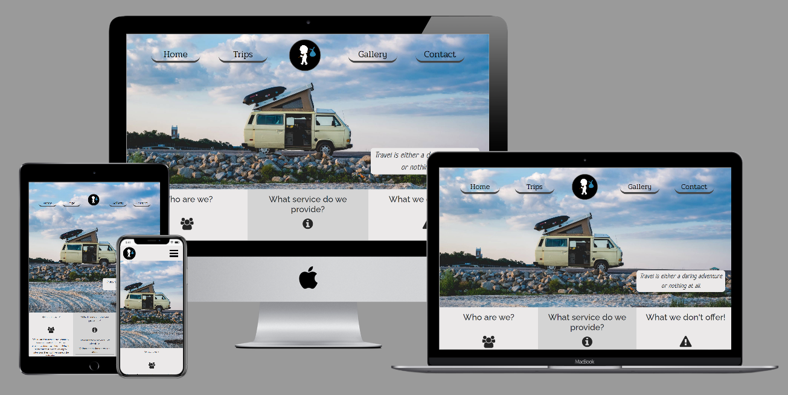

# Stick and Bindle 

Stick and Bindle is a fictional adventure travel company based in Dublin, Ireland.
The company offers unique trips to lesser travelled destinations for customers who want a change from generic holidays abroad.
Whether that be riding on top of a train through the Sahara or herding livestock in the Mongolian steppe.

[View the live project by clicking here.](https://shanekeran.github.io/stickandbindle/)

## User Experience (UX)
___
### Overview
I used user stories and the five planes of user experience design as a framework for planning the project.

### User stories

*As a site user, I want to*

- Recognise that Stick and Bindle is a travel website and to understand clearly what services they can provide to me.
- Feel confident regarding the legitimacy of the website so that I feel comfortable doing business with them.
- Easily able to contact the company if i have further questions regarding one of their available trips.
- Easily view the different destinations and activities on offer and short descriptions on each one so I can decide which trip appeals to me.

*As the site owner, I want*

- To ensure my website is on standard with the websites of competitors in the travel industry.
- To display vivid imagery in order to instil curiousity and excitement in site users around the trips we provide.
- As a newly founded company to promote our brand throughout the site.
- To ensure the website is responsive and maintains its visual appeal on desktops, laptops, tablets and mobile phones.

### Strategy

The purpose of the website is promote the services provided by Stick and Bindle 
and give a brief background of the company since they are a newly founded company and not well established in the market yet.
The target market is the younger, thrill-seeking travelling enthusiat. The type who would enjoy getting out of their comfort zone and
venturing into the extremes of a country.

After reviewing competitor websites, I noted their use of large captivating imagery and marketing their trips as fun and unique. 
This is something that the stick and bindle website needs to match otherwise it'll be deemed as boring in comparison.

The strategy for the project is to implement the needs previously outlined in the user stories and to also meet the business goals.

The Business goals which the website must fulfill is increasing brand awareness and to drive sales for the trips on offer.
We aim to achieve this by including the company logo inside the header and footer on each page and driving business to consumer (B2C) sales through the use
of imagery and enticing captions, detailing the experiences available on each trip. This will be an emotional trigger prompting the user
to get in touch via the contact form.

Actioning the needs outlined by each party in the user stories is also part of the overall strategy.

### Scope

The features to be included on the website are:
- Large hero image on the home page, with animated movement.
- Large background images on the trips page for each destination.
- Simple contact form.
- Testimonials.
- Hover captions on gallery images.
- Arrows on the trips page that take the user to the next destination/further down the page.
- Navigation bar with a logo in the center. On smaller devices it will become a drop down menu.

Features to be added in a later update:
- An online payment system so customers can book their trip before needing to contact the company to arrange dates and plans etc.

### Structure

The website consists of four pages: Home, Trips, Gallery and Contact.
These are ordered in the logical path of the user navigating through the site.

1. Home.

    The home page features a large animated hero image and on larger screen sizes it has an inspirational quote on the side of the image.
    The main content of the home page will provide the user information on who the company is, what they do and don't offer.
    At the end of the page there is a call-to-action button to prompt the user to the next page.

2. Trips

    The trips page contains four cards for each destination, similar to a row of brochures in a travel agency. 
    Each card contains a small description and link to that particular destination on the page.
    Below the card section is four large background images with details of each trip provided.

3. Gallery

    The Gallery page has 9 images that give the user an idea of what they'll be getting up to on one of their trips.

4. Contact

    The Contact page has a simple form, which asks for basic details and a text area to write a message. 
    Beneath the form is 3 testimonials with customer image, rating and short review.

### Skeleton

I used Balsamiq to create wireframes for each page. I designed a wire frame for desktop, tablet and mobile phone.

- [Home](assets/documents/wireframes/index-wireframe.png)
- [Trips](assets/documents/wireframes/tours-wireframe.png)
- [Gallery](assets/documents/wireframes/gallery-wireframe.png)
- [Contact](assets/documents/wireframes/contact-wireframe.png)

### Surface

#### Colour
The colour theme chosen for the website is blue(#5fa9cc) and grey (#ebe9e9 + #d4d4d4). I chose these colours as i felt they were simple yet visually appealing.
They also match the hero image well.

#### Typography
I use a mixture of fonts throughout the site. Lato(sans-serif) is my main body font, I chose this as it is very readable. Raleway(sans-serif) is used for headings, Pridi(serif) for my navigation bar 
and Neucha for my hero image quote. All fonts have backup default fonts in the event that we cannot connect to Google Fonts.

#### Design 
Overall the finished product looks very similar to the wireframes except for the trips.html page. On completion of the page, I felt the design looked poor so I changed the stucture to
full width background images (on large screens) to give a better aesthetic.

## Technologies used
___ 
### Languages 
- HTML5
- CSS3

### Frameworks, Libraries & Programs used
1. Git 
    
    Used for version control.

2. GitHub 

    Project files were pushed from Git to GitHub.

3. Gitpod

    I used Gitpod's dev environment to write the code for my project.

4. Bootstrap 4.5.2

    Bootstrp was used to make a collapsable navigation bar, responsive flex design for the gallery page, card templates on the trips page and a contact form template.

5. Google Fonts

    Google Fonts was used to import Lato, Raleway, Pridi and Neucha into styles.css.

6. Font Awesome

    Font Awesome was used to display social media icons in the footer, icons on the home page and star review icons in the testimonial section.

7. Adobe Creative Suite

    This was used to create the logo for Stick and Bindle.

8. jQuery

    jQuery in addition to Bootstrap, made the navbar responsive.

9. Balsamiq

    Balsamiq was used to create the wireframes for each page.

## Testing
___

The W3C Markup Validator and W3C CSS Validator Services were used to validate every page of the project to ensure there were no syntax errors.

### HTML validation:
- [Home](https://validator.w3.org/nu/?doc=https%3A%2F%2Fshanekeran.github.io%2Fstickandbindle%2F)
- [Trips](https://validator.w3.org/nu/?doc=https%3A%2F%2Fshanekeran.github.io%2Fstickandbindle%2Ftrips.html)
- [Gallery](https://validator.w3.org/nu/?doc=https%3A%2F%2Fshanekeran.github.io%2Fstickandbindle%2Fgallery.html)
- [Contact](https://validator.w3.org/nu/?doc=https%3A%2F%2Fshanekeran.github.io%2Fstickandbindle%2Fcontact.html)

### CSS Validation

- [style.css](assets/documents/css-validation.JPG)

### Testing the User stories

#### Site User
1. Recognise that Stick and Bindle is a travel website and to understand clearly what services they can provide to me.
    * The user will be met with a visual representation of the site when they view the main hero image which captures the essence of a classic roadtrip.
    * For further clarification, the content of the home page addresses who the company is and what service they provide.

2. Feel confident regarding the legitimacy of the website so that I feel comfortable doing business with them.

    * The user will be able to learn more about the company through links to Facebook, Twitter and Instagram in the footer section of each page. This is where a user would normally look for these links.
    * There are also 3 customer testimonials on the contact page so interested users are given extra validation when thinking of connecting with the company.

3. Easily able to contact the company if i have further questions regarding one of their available trips.

    * The Contact page is easily seen on the navigation bar. Upon entering the Contact page, the user is greeted with a contact form for contacting the company.
    * The form has been tested to ensure no field can be left blank when attempting to click the submit button. If a user does so, the browser will prompt them to enter the required information.

4. Easily view the different destinations and activities on offer and short descriptions on each one so I can decide which trip appeals to me.

    * The user will be able to find the Trips page on the navigation bar.
    * There is also a call-to-action button on the home page labelled "Browse Destinations" which will also take them to the Trips page.
    * When they reach the Trips page, they will see four cards summarising each tour. Each card links to a different section of the page with more information.

#### Site Owner
1. To ensure my website is on standard with the websites of competitors in the travel industry.

    * While this is subjective, I feel the design and features with respect to the scope of this project have matched those of the competitors such as Lupine Travel and Young Pioneer Tours.
           
2. I want to display vivid imagery in order to instil curiousity and excitement in site users around the trips we provide.

    * Large animated hero image on the home page.
    * Full screen width background images for each destination on the Trips page (when viewed on larger screens).
    * A collection of nine images on the gallery page.

3. As a newly founded company to promote our brand throughout the site.

    * Company logo created in the Adobe Creative Suite and displayed at the center of the navigation bar on large screens and on the left of the mobile navigation bar.
    * The logo is also featured inside the footer of each page.

4. To ensure the website is responsive and maintains its visual appeal on desktops, laptops, tablets and mobile phones.

    * Tested using Google Dev tools and responsinator. Website efficently scales up and down according to screen size.

### Further Testing

- Website has been tested on the following browsers, using the latest version available: Chrome, Edge, Safari, Firefox and Internet Explorer. The tests were successful.
- All internal and external links on the website have been tested and work as intended. Tested by clicking every link on each page.
- I used Lighthouse to test each page for accessibility and performance.
    * Home [Desktop](assets/documents/lighthouse/index-desktop.JPG) \ [Mobile](assets/documents/lighthouse/index-mobile.JPG)
    * Trips [Desktop](assets/documents/lighthouse/trips-desktop.JPG) \ [Mobile](assets/documents/lighthouse/trips-mobile.JPG)
    * Gallery [Desktop](assets/documents/lighthouse/gallery-desktop.JPG) \ [Mobile](assets/documents/lighthouse/gallery-mobile.JPG)
    * Contact [Desktop](assets/documents/lighthouse/contact-desktop.JPG) \ [Mobile](assets/documents/lighthouse/contact-mobile.JPG)

    I am happy with the overall result, although mobile could use some further improvements.

    After the intial results, I decreased the size of all images to speed up load times, preloaded my hero image and added rel="noopener noreferrer" to all external links for security reasons.

### Known Bugs and Fixes

1. Images not displaying correctly, only alt text displaying.
    Image links were not direct image links.

2. Arrow icons on the Trips page were not centered correctly.
    Added "transform: translateX(-50%);" to css positioning. This was sourced from Stack Overflow Code sourced from [Stack Overflow.]("https://stackoverflow.com/questions/32206116/position-absolute-left50-does-not-position-span-in-the-middle").

3. On mobile and tablet, when the navigation bar toggler icon was selected, the menu items would drop down but were hidden behind the main content divs.
    Added z-index to the navigation bar to make it display in front of all other content.

4. Navigation bar not centered on Internet Explorer, it defaults the left side of the window.
    Added "-ms-flex-pack: center;" directly above the original "justify-content: space-evenly;.

5. Navigation bar not centered on Safari version 10.
    This still remains an issue. Tested on latest version of Safari(14) and Navigation bar was properly aligned.

## Deployment
___
### Github

This project is deployed using GitHub pages using the following process,

### Deploying a GitHub Repository via GitHub Pages

1. In your Repository section, select the Repository you wish to deploy.
2. In the top horizontal Menu, locate and click the Settings link.
3. Inside the Setting page, scroll down to locate the GitHub Pages Section.
4. Under "Source", select the None tab and change it to "Master" and click Save.
5. Finally once the page resets scroll back down to the GitHub Pages Section to see the following message "Your site is ready to be published at (Link to the GitHub Page Web Address)". It can take time for the link to open your project initially, so please don't be worried if it down not load immediately.

### Forking the Github Repository

You can fork a GitHub Repository to make a copy of the original repository to view or make changes without it affecting the original repository.

1. Find the GitHub repository.
2. At the top of the page to the right, under your account, click the Fork button.
3. You will now have a copy of the repository in your GitHub account.

### Making a Local Clone

1. Log in to GitHub and locate the GitHub Repository
2. Click the "Code" button and a dropdown menu will appear.
3. To clone the repository using HTTPS, under "Clone with HTTPS", copy the link.
4. In Gitpod, change the directory to the location you would like the cloned directory to be located.
5. Type "git clone", and paste the link you copied in step 3.
6. Press Enter to have the local clone created.

## Credits
___
### Code

- Stack Overflow

    Stack Overflow helped solve these issues features:
    
    * My navbar not being centered on internet explorer. ([Source](https://stackoverflow.com/questions/43979702/display-flex-not-working-on-internet-explorer/43979973)).
    * Absolute positioned icons not being centered on the trips page. ([Source](https://stackoverflow.com/questions/32206116/position-absolute-left50-does-not-position-span-in-the-middle)).
    * Figuring out how to add an animated pan to my hero image. ([Source](https://stackoverflow.com/questions/58110268/pan-background-image-animation)).

- Bootstrap
    
    I used Bootstrap for my navigation bar and also on my gallery page to make it responsive. 
    In addition, I took advantage of a [bootstrap contact form template](https://bootsnipp.com/snippets/95Oj) and a [card template](https://startbootstrap.com/template/heroic-features) on my trips page.

- https://addyosmani.com/

    To improve my Google Lighthouse score, I used this line of code "link rel="preload" as="image" href="hero-image.jpg" to preload my hero image.

- Code Institute

    I implemented what I have learned over the last couple of months in the HTML, CSS and User Centric modules of the Full Stack Software development course.

### Media

- Unsplash

    I used [this unsplash image](https://unsplash.com/photos/3xpalrYpiwo) on my home page. Original photo by Nick Dunlap.

- Wikipedia

    I feature four country flags on the site, all sourced from Wikipedia.
    1. [Ethiopia](https://en.wikipedia.org/wiki/Flag_of_Ethiopia#/media/File:Flag_of_Ethiopia.svg)
    2. [India](https://en.wikipedia.org/wiki/Flag_of_India#/media/File:Flag_of_India.svg)
    3. [Mongolia](https://en.wikipedia.org/wiki/Flag_of_Mongolia#/media/File:Flag_of_Mongolia.svg)
    4. [Mauritania](https://en.wikipedia.org/wiki/Flag_of_Mauritania#/media/File:Flag_of_Mauritania.svg)

### Acknowledgements

- My mentor, Antonio Rodriguez, for his helpful feedback and guidance.

- My fellow Code Institute students for their suggestions.

- Tutor support at Code Institue, for answering my technical questions.