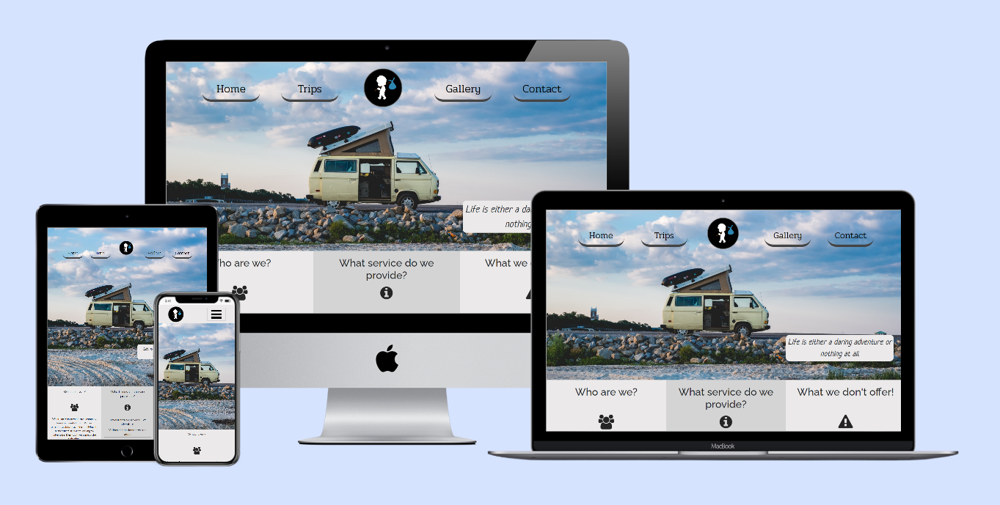

# Stick and Bindle Website

Stick and Bindle is a fictional adventure travel company based in Dublin, Ireland.
The company offers unique trips to lesser travelled destinations for customers who want a change from generic holidays abroad.
Whether that be riding on top of a tarin through the Sahara or herding livestock in the Mongolian steppe.

[View the live project by clicking here.](https://shanekeran.github.io/stickandbindle/)

## User Experience (UX)
___
### Overview

Stick and bindle's website is designed to be responsive on all screen sizes while still maintaining its visual appeal. 
This is important as their target market is a younger audience who are likely to connect through their mobile device.

### User stories

*As a site user, I want*

- To recognise that Stick and Bindle is a travel website and to understand clearly what services they can provide to me.
- To feel confident regarding the legitimacy of the website by reading the reviews of previous customers and learn more about the company through their other social media platforms.
- To be easily able to contact the company if i have further questions regarding one of their available trips or if I'm interested in making a booking.
- To easily view the different destinations and activities on offer and short descriptions on each one to decide which trip appeals to me.

*As the site owner, I want*

- To ensure my website is on standard with the websites of competitors in the travel industry.
- To instil curiousity and excitement in site users around the trips we provide.
- As a newly founded company to promote our brand throughout the site.
- To ensure the website is viewable on desktops, laptops, tablets and mobile phones.

### Strategy

The purpose of the website is promote the services provided by Stick and Bindle 
and give a brief background of the company since they are a newly founded company and not well established in the market yet.
The target market is the younger, thrill-seeking travelling enthusiat. The type who would enjoy getting out of their comfort zone and
 venturing into the extremes of a country.

 After reviewing competitor websites, I noted their use of large captivating imagery and marketing their trips as fun and unique. 
 This is somthing that the stick and bindle website needs to match otherwise it'll be deemed as boring in comparison.

 The strategy for the project is to implement the needs previously outlined in the user stories and to also meet the business goals.

 The Business goals which the website must fulfill is increasing brand awareness and to drive sales for the trips on offer.
 We aim to achieve this by including the company logo inside the header and footer on each page and driving business to consumer (B2C) sales through the use
 of imagery and enticing captions, detailing the experiences available on each trip. This will be an emotional trigger prompting the user
 to get in touch via the contact form.

 Actioning the needs outlined by each party in the user stories is also part of the overall strategy.

### Scope

The features to be included on the website are:
- Large hero image on the home page, with animated movement.
- Large background images on the trips page for each destination.
- Simple contact form.
- Testimonials.
- Hover captions on gallery images.
- Arrows on the trips page that take the user to the next destination/further down the page.
- Navigation bar with a logo in the center. On smaller devices it will become a drop down menu.

### Structure

The website consists of four pages: Home, Trips, Gallery and Contact.
These are ordered in the logical path of the user navigating through the site.

1. Home.
The home page features a large animated hero image and on larger screen sizes it has an inspirational quote on the side of the image.
The main content of the home page will provide the user information on who the company is, what they do and don't offer.
At the end of the page there is a call-to-action button to prompt the user to the next page.

2. Trips
The trips page contains four cards for each destination, similar to a row of brochures in a travel agency. 
Each card contains a small description and link to that particular destination on the page.
Below the card section is four large background images with details of the each trip provided.

3. Gallery
The Gallery page has 9 images that give the user an idea of what they'll be getting up to on one of their trips.

4. Contact
The Contact page has a simple form, which asks for basic details and a text area to write a message. 
Beneath the form is 3 testimonials with customer image, rating and short review.

### Skeleton

### Surface
